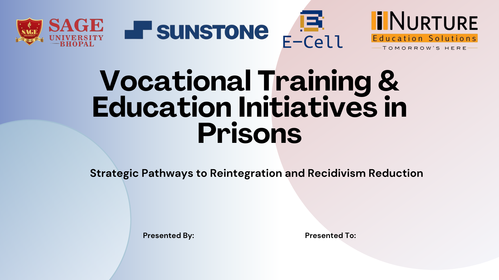

# Case Study: Vocational Training & Education Initiatives in Prisons

This project explores strategic pathways to **reintegration and recidivism reduction** through specialized education and vocational training programs in correctional facilities.

---

## 🎯 Project Overview
Modern prison systems are gradually shifting from punishment-focused models to **rehabilitation-oriented frameworks**.  
This presentation communicates the importance of education, employable skills, and structured reform programs in prisons to support long-term social reintegration.

---

## 🖼️ Visual Preview
| Slide 1: Introduction | Slide 6: Vocational Programs | Slide 10: India Success |
| :--- | :--- | :--- |
|  |  |  |

---

## 🛠️ Key Topics Covered
- **Educational Initiatives**: Basic literacy, secondary education, and higher learning access for inmates  
- **Vocational Training**: Skill-based programs such as carpentry, computer literacy, tailoring, and mechanical trades  
- **Stakeholder Involvement**: Contributions from government bodies, NSDC, and NGOs  
- **Reintegration Logic**: Transforming inmates into employable, productive citizens to reduce repeat offenses  

---

## ⚙️ Design & Communication Strategy
- **Visual Hierarchy**: Corporate-style geometric layouts to present dense social data clearly  
- **Clarity of Message**: Simplified systemic challenges like infrastructure limits and social stigma  
- **Call to Action**: Advocates for strengthening reformative education and skill-development policies  

---

## 📌 Academic Foundation
This presentation is informed by government reports, criminology research, and rehabilitation case studies related to prison education and vocational reform.

---

## 📧 Interested in a similar presentation?
I specialize in converting academic and policy research into **professional, presentation-ready visual assets**.

- **WhatsApp**: 7974304053  
- **Email**: shubham.asp.da@gmail.com
